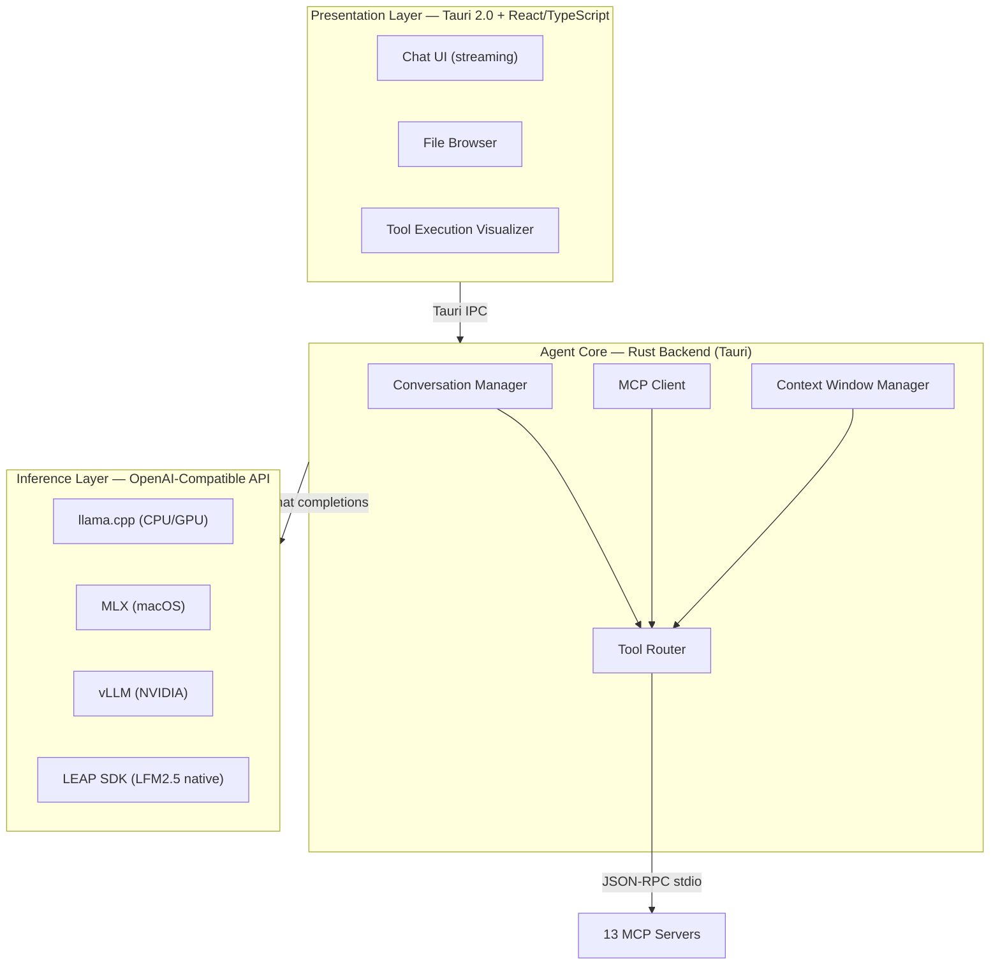

# LocalCowork — Product Requirements Document

> **A locally-run AI desktop agent powered by LFM2.5-24B**
> Version 2.0 | February 2026 | Author: Chintan Sanghvi | Classification: Confidential

---

## Table of Contents

1. [Executive Summary](#1-executive-summary)
2. [Strategic Philosophy](#2-strategic-philosophy)
3. [Feasibility Assessment](#3-feasibility-assessment)
4. [Product Architecture](#4-product-architecture)
5. [MCP Tool Architecture](#5-mcp-tool-architecture)
6. [Use Cases — Detailed Specification](#6-use-cases--detailed-specification)
7. [Feature Specification by Release](#7-feature-specification-by-release)
8. [User Experience Design](#8-user-experience-design)
9. [Technical Stack](#9-technical-stack)
10. [Development Strategy](#10-development-strategy)
11. [Competitive Positioning](#11-competitive-positioning)
12. [Risks and Mitigations](#12-risks-and-mitigations)
13. [Success Metrics](#13-success-metrics)
14. [Appendix: MCP Tool Registry](#appendix-mcp-tool-registry)

---

## 1. Executive Summary

LocalCowork is a desktop AI agent application that runs entirely on the user's local machine — no cloud, no API keys, no data leaving the device. It delivers a Claude Cowork-style experience powered by a locally-hosted language model, initially using **Qwen2.5-32B-Instruct** as the development proxy, with a planned swap to Liquid AI's **LFM2.5-24B** upon its release in Q1 2026.

The product targets knowledge workers, enterprise teams in regulated industries, and privacy-conscious professionals who need AI-assisted file management, document processing, meeting intelligence, and local workflow automation — all without trusting a third-party cloud provider.

Unlike cloud-based assistants, LocalCowork operates under a strict **local-only architecture**: the model runs on the user's CPU/GPU/NPU, tool execution happens in a sandboxed process on the same machine, and all data — files, transcripts, meeting notes, calendar entries — stays on disk. The **Model Context Protocol (MCP)** provides the standard glue layer between the language model and all local tools.

### Key Value Propositions

- **100% Local & Private:** No data leaves the machine. No cloud dependency. No API costs. Ideal for legal, healthcare, finance, and government use cases where data sovereignty is non-negotiable.
- **No-Code Tool Use:** The model does not write code. Instead, it calls structured tools via MCP — file operations, document conversion, calendar management, email drafting — making it accessible to non-technical users.
- **Model-Swappable Architecture:** Built with an abstraction layer so the underlying LLM can be swapped from Qwen to LFM2.5-24B (or any future model) without changing the application layer.
- **Cross-Platform:** Native desktop experience on both macOS and Windows via Tauri, with sub-30MB installer size.
- **MCP-Native:** Full Model Context Protocol support means the tool ecosystem is extensible — anyone can add new MCP servers for new capabilities.
- **Closed-Loop Actions:** Not just analysis — produces actions and artifacts with human-in-the-loop confirm + undo at every step.

---

## 2. Strategic Philosophy

LocalCowork's product strategy is informed by three complementary perspectives:

### 2.1 "Ship powerful primitives that compose" — Allen Zhao

The product does not try to build monolithic features. Instead, it ships a set of **composable MCP tools** (filesystem, OCR, document extraction, calendar, email, knowledge base) that the model orchestrates dynamically. A receipt extraction workflow and a contract redlining workflow share 80% of the same tool primitives — the model simply composes them differently based on intent.

### 2.2 "Find the moments that feel like magic" — Stewart Butterfield

We bias toward use cases with **immediate, visible impact**. The "Downloads triage" workflow (messy folder → organized, renamed, filed in seconds) and "Screenshot-to-Action" (screenshot of an error → fix steps proposed) create "wow" moments that drive word-of-mouth adoption. These are not enterprise pitches — they are felt improvements in daily life.

### 2.3 "Pick wedges that can become a platform" — Satya Nadella

The initial wedge is **Secure Local Document Ops** (contracts, receipts, forms, meeting artifacts). This vertical hits all three criteria — high frequency, privacy-sensitive, and action-oriented. Once users trust LocalCowork with their documents, the platform extends naturally into calendar management, email drafting, knowledge search, and full personal operations.

### The Compelling Pattern

A use case is especially strong if it satisfies **all three criteria**:

| Criterion | Test |
|---|---|
| **High-frequency pain** | Weekly or daily task |
| **Local-only advantage** | Privacy, latency, or deep OS access is the differentiator |
| **Closed loop** | Produces actions/artifacts (not just analysis) with confirm + undo |

**Recommended Platform Wedge:** "Secure Local Document Ops" — contracts, receipts, forms, meeting artifacts. This hits all three criteria and naturally expands into the full product vision.

---

## 3. Feasibility Assessment

### 3.1 Can a 24B Model Replace Code with Tool Calling?

**Yes — with the right architecture.** Claude Cowork's power comes not from the model writing Python, but from its ability to understand intent, select the right tool, provide correct parameters, and chain multiple tool calls. A 24B model can do this reliably because:

- **LFM2.5 architecture is optimized for tool use:** Even at 1.2B, LFM2.5-Instruct scores 86.23% on IFEval (instruction following) and 47.33% on IFBench (function calling). At 24B, these scores would be substantially higher, likely approaching 90%+ on IFEval.
- **Qwen2.5-32B proves the concept today:** Community benchmarks show Qwen2.5-32B delivers extremely stable tool calling, rarely hallucinating calls or forgetting parameters. It is the most recommended model for local agent use in the OpenClaw community.
- **No code generation needed:** Every action in LocalCowork is a pre-built tool exposed via MCP. The model's job is to select tools and provide arguments — a structured output task that 24B models handle well.

### 3.2 Hardware Requirements

A 24B model in Q4 quantization requires approximately 14–16 GB of RAM/VRAM.

| Platform | Minimum Spec | Recommended Spec |
|---|---|---|
| macOS | M1 Pro / 16GB Unified | M2 Pro+ / 32GB Unified |
| Windows (GPU) | RTX 3090 / 24GB VRAM | RTX 4090 / 24GB VRAM |
| Windows (CPU) | Ryzen AI 9 / 32GB RAM | Ryzen AI 9 HX / 64GB RAM |
| Windows (NPU) | Snapdragon X Elite | Snapdragon X Elite + 32GB |

LFM2.5's hybrid architecture (80% convolution, 20% attention) gives it a significant inference speed advantage over pure-transformer models at the same parameter count. Liquid AI reports 239 tok/s decode at 1.2B on AMD CPU. At 24B with Q4 quantization, we estimate **30–60 tok/s on Apple M2 Pro** (via MLX) and **40–80 tok/s on RTX 4090** (via vLLM/llama.cpp), which is fast enough for interactive tool-calling workflows.

### 3.3 What a 24B Model Cannot Do Well

Honest constraints that shape the product scope:

- **Deep knowledge-intensive reasoning:** The model will not match GPT-4 or Claude on complex multi-hop research questions. LocalCowork compensates by scoping to structured tool workflows, not open-ended research.
- **Code generation:** Liquid AI explicitly recommends against using LFM models for programming. LocalCowork's architecture avoids this entirely by using pre-built tools.
- **Long creative writing:** Multi-page essays or reports with nuanced argumentation will not match cloud models. LocalCowork targets structured document generation (summaries, templates, forms) instead.
- **Multi-language fluency:** While LFM2.5 supports Japanese and English well, other languages may require fine-tuning. Initial release targets English only.

### 3.4 Feasibility Verdict

| Capability | Feasible? | Notes |
|---|---|---|
| Tool calling / function calling | **YES** | Core strength of LFM2.5 architecture |
| Multi-step tool chaining | **YES** | Proven at 32B with Qwen; 24B should match |
| File management & organization | **YES** | Structured output task, well within scope |
| Document summarization | **YES** | LFM2.5 + AMD demo already proven at 2.6B |
| OCR + data extraction | **YES** | Local Tesseract/PaddleOCR + schema extraction |
| Meeting transcription + action items | **YES** | With Whisper.cpp + LFM2.5-Audio multimodal variant |
| Calendar & task management | **YES** | MCP tool calls to local calendar APIs |
| PII/secrets detection | **YES** | Regex + model classification, no cloud needed |
| Email drafting | **PARTIAL** | Draft generation yes; nuanced tone may vary |
| Complex research / reasoning | **NO** | Out of scope; defer to cloud models |
| Code generation | **NO** | Explicitly not recommended by Liquid AI |

---

## 4. Product Architecture

### 4.1 System Overview

LocalCowork is a three-layer architecture designed for modularity and model-swappability:



### 4.2 Model Abstraction Layer

The critical design decision enabling the Qwen-to-LFM2.5 swap. The Agent Core communicates with the inference layer exclusively via an **OpenAI-compatible chat completions API**.

- **Development phase:** Run Qwen2.5-32B-Instruct locally via Ollama or llama.cpp, exposed as an OpenAI-compatible endpoint at `localhost:11434`.
- **Production phase:** Swap to LFM2.5-24B served by llama.cpp, MLX, or the LEAP SDK. Same API contract, same tool-calling format. No application code changes.
- **Tool call format:** Normalize both models to output JSON function calls (Qwen natively uses this; LFM2.5 can be configured to output JSON instead of Pythonic calls via system prompt).

### 4.3 Conversation & Context Management

```typescript
interface ConversationManager {
  // Stores all conversations in local SQLite
  conversations: SQLiteDB;

  // Manages context window (32k tokens for LFM2.5)
  contextWindow: {
    systemPrompt: string;        // ~500 tokens — persona + tool definitions
    toolDefinitions: Tool[];     // ~2000 tokens — all registered MCP tools
    conversationHistory: Message[]; // rolling window
    activeContext: string;       // currently relevant file/doc content
  };

  // Audit log for every tool call
  auditLog: {
    timestamp: Date;
    toolName: string;
    arguments: Record<string, any>;
    result: any;
    userApproved: boolean;
  }[];
}
```

### 4.4 Human-in-the-Loop Control Flow

Every tool execution follows this pattern:

```
User Intent → Model Plans → [Preview Shown to User] → User Confirms → Execute → Result + Undo Option
```

- **Non-destructive actions** (read, list, search, extract): execute immediately, show results.
- **Mutable actions** (rename, move, create): show preview, require confirmation.
- **Destructive actions** (delete, overwrite): show explicit warning, require typed confirmation.
- **All mutable/destructive actions**: push to undo stack (original state stored in SQLite).

---

## 5. MCP Tool Architecture

Every capability in LocalCowork is exposed as an MCP server. The Agent Core acts as the MCP client, routing the model's tool calls to the appropriate server. Adding a new capability means adding a new MCP server, not modifying application code.

### 5.1 Core MCP Servers

| MCP Server | Tools Provided | Implementation |
|---|---|---|
| `filesystem` | `list_dir`, `read_file`, `write_file`, `move_file`, `copy_file`, `delete_file`, `search_files`, `get_file_info`, `watch_folder`, `get_metadata` | Rust Tauri commands with sandboxed access |
| `document` | `convert_format`, `extract_text`, `create_pdf`, `merge_pdfs`, `create_docx`, `read_spreadsheet`, `diff_documents`, `fill_pdf_form` | LibreOffice headless + Pandoc + Python libs |
| `ocr` | `extract_text_from_image`, `extract_text_from_pdf`, `extract_structured_data`, `extract_table` | Tesseract / PaddleOCR (local) |
| `calendar` | `list_events`, `create_event`, `update_event`, `delete_event`, `find_free_slots`, `create_time_block` | Local .ics file management + system calendar API |
| `email` | `draft_email`, `list_drafts`, `search_emails`, `summarize_thread`, `send_draft` | MBOX/Maildir reader + SMTP draft queue |
| `meeting` | `transcribe_audio`, `summarize_transcript`, `extract_action_items`, `generate_minutes`, `extract_commitments` | Whisper.cpp (local) + LFM2.5-Audio-1.5B |
| `knowledge` | `index_folder`, `search_documents`, `ask_about_files`, `update_index`, `get_related_chunks` | Local vector store (SQLite-vec) + chunking pipeline |
| `clipboard` | `get_clipboard`, `set_clipboard`, `clipboard_history` | OS clipboard API via Tauri |
| `system` | `get_system_info`, `open_application`, `take_screenshot`, `list_processes`, `open_file_with` | OS-specific APIs via Tauri commands |
| `task` | `create_task`, `list_tasks`, `update_task`, `delete_task`, `get_overdue`, `daily_briefing` | Local SQLite task database |
| `audit` | `get_tool_log`, `generate_audit_report`, `export_audit_pdf`, `get_session_summary` | Reads from tool execution audit log |
| `security` | `scan_for_pii`, `scan_for_secrets`, `find_duplicates`, `propose_cleanup`, `encrypt_file`, `decrypt_file` | Regex patterns + model classification + GPG/age |
| `data` | `write_csv`, `write_sqlite`, `query_sqlite`, `deduplicate_records`, `apply_rules`, `summarize_anomalies` | Local SQLite + CSV libraries |

### 5.2 MCP Server Communication

All MCP servers run as local child processes managed by the Tauri backend. Communication uses **JSON-RPC over stdio** (the standard MCP transport). Each server declares its tools at startup, and the Agent Core aggregates them into the model's tool definitions.

```json
// Example: MCP tool definition sent to the model
{
  "name": "filesystem.move_file",
  "description": "Move a file from source to destination path. Requires user confirmation.",
  "parameters": {
    "type": "object",
    "properties": {
      "source": { "type": "string", "description": "Absolute path of file to move" },
      "destination": { "type": "string", "description": "Absolute path of destination" },
      "create_dirs": { "type": "boolean", "description": "Create parent directories if missing", "default": true }
    },
    "required": ["source", "destination"]
  },
  "confirmation_required": true,
  "undo_supported": true
}
```

### 5.3 MCP Server Configuration

Third-party MCP servers can be added via a configuration file:

```json
// ~/.localcowork/mcp_servers.json
{
  "servers": {
    "filesystem": {
      "command": "localcowork-mcp-filesystem",
      "args": ["--sandbox", "--allowed-paths", "/Users/chintan/Documents"],
      "env": {}
    },
    "custom-crm": {
      "command": "npx",
      "args": ["-y", "@mycompany/mcp-crm-server"],
      "env": { "DB_PATH": "/Users/chintan/.crm/data.db" }
    }
  }
}
```

---

## 6. Use Cases — Detailed Specification

Each use case below includes the user job-to-be-done, the exact flow, the MCP tools required, the "why local wins" argument, and implementation notes for Claude Code.

---

### UC-1: Receipt → Reconciliation (Personal & Small Business Finance)

**Job:** Turn messy receipts/invoices into clean, searchable records without uploading financial docs anywhere.

**Compelling Pattern Score:** ✅ High-frequency (weekly) · ✅ Local-only advantage (financial docs are highly sensitive) · ✅ Closed loop (produces structured records)

**User Story:**
> "I have a folder of receipt photos and invoice PDFs from this month. Organize them into a clean spreadsheet with vendor, date, amount, and category. Flag any duplicates or anomalies."

**Flow:**

```
1. User points to folder (e.g., ~/Receipts/2026-02/)
2. filesystem.list_dir → enumerate all files
3. FOR each file:
   a. ocr.extract_text_from_image OR ocr.extract_text_from_pdf
   b. Model classifies: receipt vs invoice vs statement vs unknown
   c. ocr.extract_structured_data → { vendor, date, amount, tax, category, line_items }
4. data.deduplicate_records → flag potential duplicates (same vendor + amount + date)
5. data.write_csv → output clean CSV (or data.write_sqlite for queryable DB)
6. Model runs data.summarize_anomalies:
   - Missing fields
   - Unusually large amounts
   - Duplicate entries
   - Category mismatches
7. document.create_pdf → generate monthly summary report
8. User reviews, confirms, adjusts categories if needed
```

**MCP Tools Required:**
- `filesystem.list_dir`, `filesystem.read_file`, `filesystem.get_metadata`
- `ocr.extract_text_from_image`, `ocr.extract_text_from_pdf`, `ocr.extract_structured_data`
- `data.write_csv`, `data.write_sqlite`, `data.deduplicate_records`, `data.summarize_anomalies`
- `document.create_pdf`

**Implementation Notes for Claude Code:**
- The OCR server should use PaddleOCR (better for receipts) with Tesseract as fallback.
- Schema extraction uses the model itself: feed OCR text → model extracts structured JSON using a predefined schema.
- The dedupe logic is rule-based (not model-based): match on vendor name similarity (Levenshtein > 0.85) + amount equality + date within 3 days.
- Store raw OCR text alongside structured data for auditability.

---

### UC-2: Contract / NDA Copilot (Local Legal Redlining + Clause Diff)

**Job:** Compare two versions of a contract and produce a structured "what changed + risk flags" report, offline.

**Compelling Pattern Score:** ✅ High-frequency (weekly for legal teams) · ✅ Local-only advantage (legal teams care intensely about confidentiality) · ✅ Closed loop (produces redline report + email draft)

**User Story:**
> "Compare this NDA draft with the version our counsel sent back. Show me what changed, flag any risky clauses, and draft an email to counsel summarizing my concerns."

**Flow:**

```
1. User provides two files: original.pdf + revised.docx
2. document.extract_text → extract both documents to plain text
3. document.diff_documents → produce structured diff (added/removed/modified sections)
4. Model analyzes each changed section:
   a. Classify change type: substantive vs formatting vs cosmetic
   b. Flag risk indicators: indemnification changes, liability caps modified,
      termination clause changes, non-compete scope changes
5. knowledge.search_documents → match changed clauses against local clause library
   (user can build this over time from their own contracts)
6. Model generates structured report:
   - Section-by-section changelog
   - Risk flags with severity (high/medium/low)
   - Recommended response for each substantive change
7. document.create_pdf → produce redline summary report
8. email.draft_email → draft response to counsel with key concerns
9. User reviews, edits draft, sends manually
```

**MCP Tools Required:**
- `document.extract_text`, `document.convert_format`, `document.diff_documents`
- `knowledge.index_folder`, `knowledge.search_documents`
- `document.create_pdf`
- `email.draft_email`

**Implementation Notes for Claude Code:**
- The diff engine should operate at paragraph level, not line level. Use sentence-level difflib with context windowing.
- Clause library: a local SQLite-vec index of clause embeddings from the user's own historical contracts. Incrementally built as the user processes more contracts.
- Risk flags are model-generated, not rule-based — the 24B model can identify substantive legal changes with reasonable accuracy. But always present as "suggested flags" with disclaimer.
- The redline report should include page/section references back to the original documents.

---

### UC-3: Security & Privacy Steward (Local Machine Audit)

**Job:** Help a user understand what sensitive data exists on disk, and reduce exposure.

**Compelling Pattern Score:** ✅ High-frequency (should be regular) · ✅ Local-only advantage (scanning for secrets must be local by definition) · ✅ Closed loop (proposes actions with confirm + undo)

**User Story:**
> "Scan my Documents folder for any files containing SSNs, credit card numbers, API keys, or passwords. Show me what you found and help me secure or delete them."

**Flow:**

```
1. User grants access to target folder(s)
2. filesystem.search_files → enumerate all files, filter by type
3. FOR each file (parallelized where possible):
   a. security.scan_for_pii → regex-based detection of:
      - SSN patterns (XXX-XX-XXXX)
      - Credit card numbers (Luhn validation)
      - Email addresses in unexpected locations
      - Phone numbers
   b. security.scan_for_secrets → detect:
      - API keys (AWS, GCP, Stripe, etc. — known patterns)
      - Private keys (PEM headers)
      - Passwords in plaintext (heuristic)
      - .env files with credentials
   c. filesystem.get_metadata → age, last accessed, permissions
4. security.find_duplicates → identify redundant copies of sensitive files
5. Model produces a categorized report:
   - Critical: exposed secrets/keys (immediate action needed)
   - High: PII in unencrypted files
   - Medium: old sensitive files not accessed in 6+ months
   - Low: duplicates consuming space
6. security.propose_cleanup → for each finding:
   - Move to encrypted vault (security.encrypt_file)
   - Delete (with confirmation)
   - Ignore (with note)
7. audit.generate_audit_report → PDF record of what was scanned, found, and actioned
```

**MCP Tools Required:**
- `filesystem.search_files`, `filesystem.get_metadata`, `filesystem.move_file`, `filesystem.delete_file`
- `security.scan_for_pii`, `security.scan_for_secrets`, `security.find_duplicates`, `security.propose_cleanup`, `security.encrypt_file`
- `audit.generate_audit_report`
- `document.create_pdf`

**Implementation Notes for Claude Code:**
- PII detection is primarily **regex + rules-based** (not model-based) for speed and determinism. The model's role is interpreting context and generating the report, not scanning.
- Secret patterns should be sourced from established open-source databases (e.g., trufflehog patterns).
- Encryption: use `age` (modern, simple) rather than GPG for file encryption. Store the age identity in the system keychain.
- The scan must respect a user-configurable exclusion list (e.g., skip node_modules, .git, virtual envs).
- Progress reporting is essential — large folder scans can take minutes. Stream progress via MCP.

---

### UC-4: Download Triage (The "Superpower" Workflow)

**Job:** Downloads folder becomes a temporary inbox that auto-organizes.

**Compelling Pattern Score:** ✅ High-frequency (daily) · ✅ Local-only advantage (instant, deep OS access) · ✅ Closed loop (files renamed + moved + digest produced)

**User Story:**
> "My Downloads folder is a disaster. Watch it for new files, auto-classify them, rename them consistently, and file them into the right folders. Give me a daily digest of what arrived."

**Flow:**

```
1. filesystem.watch_folder → register watcher on ~/Downloads
2. ON new file detected:
   a. filesystem.get_metadata → size, type, timestamps, source URL (if available)
   b. ocr.extract_text_from_pdf OR document.extract_text → for docs
   c. Model classifies file into categories:
      - Receipts/invoices → ~/Documents/Finance/
      - Work documents → ~/Documents/Work/
      - Personal → ~/Documents/Personal/
      - Images/screenshots → ~/Pictures/
      - Installers/archives → ~/Archive/Software/
      - Unknown → ~/Downloads/Unsorted/
   d. Model proposes consistent filename:
      - Receipts: YYYY-MM-DD_Vendor_Amount.pdf
      - Documents: YYYY-MM-DD_Title_Source.ext
      - Images: YYYY-MM-DD_Description.ext
3. filesystem.move_file → move to destination (with confirmation on first run,
   then auto for trusted patterns)
4. END OF DAY:
   a. Model generates daily digest:
      - Files processed: 12
      - Categories: 4 receipts, 3 work docs, 2 images, 3 other
      - Total size: 47MB
      - Action needed: 2 files couldn't be classified → in Unsorted
   b. data.write_csv → append to monthly download log
```

**MCP Tools Required:**
- `filesystem.watch_folder`, `filesystem.list_dir`, `filesystem.get_metadata`, `filesystem.move_file`, `filesystem.copy_file`
- `ocr.extract_text_from_pdf`, `document.extract_text`
- `data.write_csv`

**Implementation Notes for Claude Code:**
- The folder watcher should use OS-native file watching (FSEvents on macOS, ReadDirectoryChangesW on Windows) via Tauri's filesystem watcher.
- Classification confidence threshold: if model confidence < 0.7, file goes to Unsorted and user is asked to classify (this trains future classification via few-shot examples stored in SQLite).
- Rename previews should show "before → after" in the UI before executing.
- The daily digest can be a markdown file or a system notification, user configurable.
- Must handle partial downloads gracefully (don't process files that are still being written).

---

### UC-5: Screenshot-to-Action (Instant Local Vision Loop)

**Job:** User takes a screenshot of anything and says "do the next step."

**Compelling Pattern Score:** ✅ High-frequency (multiple times daily) · ✅ Local-only advantage (instant, no upload latency; deep OS access for follow-up actions) · ✅ Closed loop (produces concrete next action)

**User Stories:**
> - "I just got this error dialog — what should I do?" → extract text → open relevant log → propose fix steps
> - "Here's the form I need to fill" → extract fields → fill PDF locally
> - "Screenshot this receipt" → capture line items → add to expense tracker

**Flow:**

```
1. User triggers screenshot (hotkey or paste from clipboard)
2. system.take_screenshot OR clipboard.get_clipboard → capture image
3. ocr.extract_text_from_image → extract all visible text
4. IF LFM2.5-VL available:
   a. Vision model analyzes layout, UI elements, spatial relationships
5. Model determines action type:
   a. ERROR DIALOG:
      - Extract error message + error code
      - filesystem.search_files → find relevant log files
      - filesystem.read_file → read recent log entries
      - Model proposes fix steps (not code — structured actions)
   b. FORM/DOCUMENT:
      - ocr.extract_structured_data → extract form fields
      - document.fill_pdf_form → fill matching PDF template
      - OR data.write_csv → capture structured data
   c. RECEIPT/INVOICE:
      - ocr.extract_structured_data → extract line items
      - data.write_sqlite → append to expense database
   d. UI/CONTENT:
      - Extract text, URLs, data
      - clipboard.set_clipboard → copy extracted content
6. Present extracted info + proposed action to user
7. User confirms → execute
```

**MCP Tools Required:**
- `system.take_screenshot`, `clipboard.get_clipboard`, `clipboard.set_clipboard`
- `ocr.extract_text_from_image`, `ocr.extract_structured_data`
- `filesystem.search_files`, `filesystem.read_file`
- `document.fill_pdf_form`
- `data.write_sqlite`, `data.write_csv`

**Implementation Notes for Claude Code:**
- Register a global hotkey (Ctrl+Shift+S / Cmd+Shift+S) for "screenshot and analyze."
- The screenshot capture must include window title and active application name (from system APIs) for context.
- The VL model (LFM2.5-VL-1.6B) runs as a separate inference process for image understanding. Fall back to pure OCR if VL model unavailable.
- For error dialogs: maintain a local index of common error patterns + known fixes (populated over time from user feedback).

---

### UC-6: Meeting-to-Execution Pipeline (Beyond Summaries)

**Job:** Not "summarize the meeting," but "make the meeting real" — close the loop from conversation to outcomes.

**Compelling Pattern Score:** ✅ High-frequency (multiple times per week) · ✅ Local-only advantage (meeting content is highly sensitive; compliance requirements) · ✅ Closed loop (creates calendar holds + email drafts + task items)

**User Story:**
> "I just finished a 45-minute project review. Transcribe it, pull out who committed to what, create calendar blocks for the follow-ups, and draft the recap email."

**Flow:**

```
1. meeting.transcribe_audio → local transcription via Whisper.cpp
   - Input: audio file or system audio capture
   - Output: timestamped transcript with speaker diarization (if available)
2. meeting.extract_commitments → model identifies:
   - WHO committed to WHAT by WHEN
   - Decisions made (and by whom)
   - Open questions / parking lot items
   - Risks raised
3. meeting.extract_action_items → structured action items:
   [{ assignee, task, deadline, context, priority }]
4. FOR each action item with a deadline:
   a. calendar.create_event → create calendar hold/reminder
   b. task.create_task → add to local task database
5. email.draft_email → compose recap email:
   - Subject: "[Meeting Name] - Recap & Action Items - [Date]"
   - Body: summary, decisions, action items table, next steps
6. meeting.generate_minutes → formal meeting minutes PDF
7. knowledge.index_folder → index transcript for future cross-meeting search
8. User reviews all outputs → confirms sends and calendar entries
```

**MCP Tools Required:**
- `meeting.transcribe_audio`, `meeting.extract_commitments`, `meeting.extract_action_items`, `meeting.generate_minutes`
- `calendar.create_event`, `calendar.find_free_slots`
- `task.create_task`
- `email.draft_email`
- `knowledge.index_folder`
- `document.create_pdf`

**Implementation Notes for Claude Code:**
- Whisper.cpp should use the `large-v3` model for best accuracy. On Apple Silicon, use the Core ML optimized variant.
- Speaker diarization: use `pyannote-audio` (local model) for speaker identification. Map speaker IDs to names via user-provided meeting attendee list.
- Commitment extraction prompt should be highly structured — use few-shot examples in the system prompt showing "Person A said → commitment identified."
- Cross-meeting search: when a user asks "what did we decide about X?", the knowledge server searches indexed transcripts and returns relevant passages with meeting dates.

---

### UC-7: Personal Operations OS (Local-First, Zero SaaS Dependency)

**Job:** Replace a patchwork of productivity apps with a local, private command center.

**Compelling Pattern Score:** ✅ High-frequency (daily) · ✅ Local-only advantage (no SaaS vendor lock-in; data portability) · ✅ Closed loop (captures → normalizes → time-blocks → daily briefing)

**User Story:**
> "I want one place for my tasks, schedule, and daily plan. Pull tasks from my emails and meeting notes, time-block my calendar, and give me a morning briefing."

**Flow:**

```
1. CAPTURE (ongoing, triggered by other workflows):
   a. meeting.extract_action_items → tasks from meetings
   b. email.search_emails → scan inbox for action-required emails
   c. clipboard.clipboard_history → capture manually added tasks
   d. task.create_task → normalize all into local task DB

2. DAILY BRIEFING (scheduled, morning):
   a. calendar.list_events → today's schedule
   b. task.get_overdue → overdue tasks
   c. task.list_tasks → tasks due today/this week
   d. email.search_emails → urgent unread emails
   e. Model generates briefing:
      - "You have 4 meetings today. 3 tasks are due. 2 are overdue.
        Your first free block for deep work is 2-4pm."

3. TIME-BLOCKING (on request):
   a. task.list_tasks → get prioritized tasks
   b. calendar.find_free_slots → available time blocks
   c. Model proposes time-block plan:
      - "I'd suggest: 9-10am for the quarterly report, 2-3pm for
        the vendor review, and 4-4:30pm for the budget email."
   d. calendar.create_event → create blocks on confirmation

4. WEEKLY REVIEW (scheduled, Friday):
   a. task.list_tasks → completed this week
   b. calendar.list_events → meetings attended
   c. Model generates weekly summary:
      - Tasks completed vs planned
      - Meeting time vs focused work time
      - Carried-over items
```

**MCP Tools Required:**
- `task.create_task`, `task.list_tasks`, `task.update_task`, `task.get_overdue`, `task.daily_briefing`
- `calendar.list_events`, `calendar.create_event`, `calendar.find_free_slots`, `calendar.create_time_block`
- `email.search_emails`, `email.summarize_thread`
- `clipboard.clipboard_history`

**Implementation Notes for Claude Code:**
- The task database schema must be simple but extensible:
  ```sql
  CREATE TABLE tasks (
    id INTEGER PRIMARY KEY,
    title TEXT NOT NULL,
    description TEXT,
    source TEXT,          -- 'meeting', 'email', 'manual', 'clipboard'
    source_ref TEXT,      -- meeting ID, email ID, etc.
    priority INTEGER DEFAULT 3,  -- 1=urgent, 5=someday
    due_date TEXT,
    completed_at TEXT,
    created_at TEXT DEFAULT CURRENT_TIMESTAMP
  );
  ```
- The daily briefing should be generated as a markdown file AND optionally as a system notification.
- Calendar integration: read .ics files (CalDAV export) or integrate with macOS EventKit / Windows Calendar API via Tauri plugins.

---

### UC-8: Portfolio / Confidential Deal Memo Analyst

**Job:** Analyze long confidential PDFs (PPMs, investment memos, term sheets) locally and produce an IC-ready brief.

**Compelling Pattern Score:** ✅ High-frequency (weekly for PE/VC/corp dev) · ✅ Local-only advantage (confidential docs must never be uploaded — this is the #1 pain point in private equity) · ✅ Closed loop (produces structured IC memo + diligence checklist)

**User Story:**
> "I have a 60-page Private Placement Memorandum and a 20-page management presentation. Analyze them and produce a 2-page investment committee brief with key metrics, risks, and a diligence checklist."

**Flow:**

```
1. User provides documents: PPM.pdf, MgmtPresentation.pdf, TermSheet.pdf
2. document.extract_text → extract all documents
3. knowledge.index_folder → build local vector index for cross-doc search
4. Model performs structured analysis:
   a. Key metrics extraction: revenue, EBITDA, growth rate, valuation, cap table
   b. Risk identification: market, execution, financial, legal, regulatory
   c. Comparable analysis: match against user's prior deal library (if indexed)
   d. Term sheet analysis: key terms, investor protections, governance rights
5. Model generates IC brief (structured template):
   - Executive summary (1 paragraph)
   - Key metrics table
   - Investment thesis (bull + bear case)
   - Risk matrix (severity × likelihood)
   - Diligence checklist with priority items
   - Recommended next steps
6. document.create_pdf → produce formatted IC brief
7. task.create_task → create diligence task items with deadlines
```

**MCP Tools Required:**
- `document.extract_text`, `document.convert_format`
- `knowledge.index_folder`, `knowledge.search_documents`, `knowledge.ask_about_files`
- `document.create_pdf`
- `task.create_task`
- `data.write_csv` (for metrics export)

**Implementation Notes for Claude Code:**
- 60-page PDFs will exceed the 32K context window. Use RAG: chunk documents, index in SQLite-vec, retrieve relevant chunks per analysis section.
- Template for IC brief should be user-customizable (stored as a markdown template in ~/.localcowork/templates/).
- The model should explicitly cite page numbers when making claims about the documents.
- For comparable analysis: maintain a local SQLite database of prior deals the user has analyzed. Over time, this becomes a valuable private dataset.

---

### UC-9: Local Codebase + Docs Navigator (Developer Mode)

**Job:** Answer questions about a local repository and machine state, plus do safe read-only actions.

**Compelling Pattern Score:** ✅ High-frequency (daily for developers) · ✅ Local-only advantage (code is sensitive; latency matters in flow state) · ✅ Closed loop (answers + runs commands + generates artifacts)

**User Story:**
> "Index this repo. Then: What does the auth module do? Run the tests for me. Summarize the git diff from this week. Generate a PR description."

**Flow:**

```
1. knowledge.index_folder → index repo (respects .gitignore)
2. QUERY MODE:
   a. User asks: "How does the auth module work?"
   b. knowledge.search_documents → find relevant files
   c. filesystem.read_file → read key files
   d. Model synthesizes answer with file references
3. COMMAND MODE (read-only by default):
   a. system.run_sandboxed → run tests: `npm test` or `pytest`
      (sandboxed: no network, no write outside repo, timeout enforced)
   b. system.run_sandboxed → `git log --oneline --since="1 week ago"`
   c. system.run_sandboxed → `git diff HEAD~5..HEAD --stat`
4. GENERATION MODE:
   a. Model reads git diff + recent commits
   b. Generates PR description (title, summary, changes, test plan)
   c. clipboard.set_clipboard → copy to clipboard for pasting into GitHub
5. LOG TAIL MODE:
   a. filesystem.read_file → tail log files
   b. Model identifies errors/warnings
   c. knowledge.search_documents → find relevant code sections
```

**MCP Tools Required:**
- `knowledge.index_folder`, `knowledge.search_documents`
- `filesystem.read_file`, `filesystem.search_files`, `filesystem.list_dir`
- `system.run_sandboxed` (NEW — sandboxed command execution)
- `clipboard.set_clipboard`

**Implementation Notes for Claude Code:**
- `system.run_sandboxed` is a restricted execution environment:
  - No network access (firewall rules via Tauri)
  - No writes outside the project directory
  - Configurable timeout (default 60 seconds)
  - Allowed commands whitelist: `git`, `npm test`, `pytest`, `grep`, `find`, `wc`, `cat`
  - User must approve command before execution
- Repo indexing should respect `.gitignore` and a configurable `.localcoworkignore` file.
- For large repos (>10K files): index only source files (by extension), not binaries or vendored deps.
- Code search should use both semantic (vector) and keyword (ripgrep) search, with results merged.

---

### UC-10: Offline Compliance Pack Generator

**Job:** Generate an auditable packet documenting what data was touched, what tools were called, and what decisions were made.

**Compelling Pattern Score:** ✅ Medium-frequency (end of engagement/project) · ✅ Local-only advantage (compliance requires complete audit trail that never left the device) · ✅ Closed loop (produces signed PDF audit package)

**User Story:**
> "I just finished reviewing those 5 contracts for the client. Generate a compliance pack showing every document I processed, every tool that ran, and every action I took or rejected."

**Flow:**

```
1. audit.get_tool_log → retrieve all tool calls for specified time range / session
2. audit.get_session_summary → aggregate by:
   - Documents touched (with hashes for integrity)
   - Tools called (with arguments and results)
   - User confirmations and rejections
   - Time spent per document
3. Model generates compliance report:
   - Cover page: analyst, date range, scope
   - Document inventory: files processed with SHA-256 hashes
   - Tool execution log: chronological record
   - Decision log: what was confirmed vs rejected by user
   - Data handling attestation: no data left the device
4. audit.export_audit_pdf → formatted PDF with:
   - Digital signature (optional, via local key)
   - Table of contents
   - Appendix: raw tool call logs
5. filesystem.write_file → save to specified location
```

**MCP Tools Required:**
- `audit.get_tool_log`, `audit.get_session_summary`, `audit.generate_audit_report`, `audit.export_audit_pdf`
- `document.create_pdf`
- `filesystem.write_file`

**Implementation Notes for Claude Code:**
- The audit log is append-only — tool calls are logged before execution, results are appended after.
- Log schema:
  ```sql
  CREATE TABLE audit_log (
    id INTEGER PRIMARY KEY,
    session_id TEXT NOT NULL,
    timestamp TEXT NOT NULL,
    tool_name TEXT NOT NULL,
    arguments TEXT,          -- JSON
    result TEXT,             -- JSON
    result_status TEXT,      -- 'success', 'error', 'rejected_by_user'
    user_confirmed BOOLEAN,
    execution_time_ms INTEGER
  );
  ```
- File hashes: compute SHA-256 of every file at time of first access. Store in audit log. Re-verify at report generation time to detect tampering.
- The compliance report template should be customizable per industry (legal, financial, healthcare).

---

## 7. Feature Specification by Release

### 7.1 MVP — Launch (Weeks 1–12)

| Feature | Use Cases Served | Priority |
|---|---|---|
| Chat UI with streaming + tool visualization | All | P0 |
| Filesystem MCP server (full CRUD + watch) | UC-4, UC-3 | P0 |
| Document extraction + conversion MCP server | UC-1, UC-2, UC-8 | P0 |
| OCR MCP server (Tesseract + PaddleOCR) | UC-1, UC-5 | P0 |
| Local knowledge base (SQLite-vec RAG) | UC-2, UC-8, UC-9 | P0 |
| Data server (CSV + SQLite writer) | UC-1, UC-7 | P0 |
| Audit logging (every tool call) | UC-10 | P0 |
| Security scanner (PII + secrets) | UC-3 | P1 |
| Task database + basic task management | UC-7 | P1 |
| Human-in-the-loop confirm + undo system | All | P0 |
| Hardware auto-detection + model setup wizard | All | P0 |

### 7.2 v1.1 — Fast Follow (Weeks 13–20)

| Feature | Use Cases Served | Priority |
|---|---|---|
| Meeting transcription (Whisper.cpp) | UC-6 | P0 |
| Calendar MCP server (.ics + system API) | UC-6, UC-7 | P0 |
| Email MCP server (MBOX/Maildir + SMTP) | UC-2, UC-6 | P1 |
| Screenshot-to-Action pipeline | UC-5 | P1 |
| Download folder watcher (persistent) | UC-4 | P1 |
| Daily briefing generation | UC-7 | P1 |
| Compliance pack generator | UC-10 | P2 |

### 7.3 v2.0 — Full Platform (Weeks 21–32)

| Feature | Use Cases Served | Priority |
|---|---|---|
| Multi-model routing (text + VL + audio) | UC-5, UC-6 | P1 |
| Sandboxed command execution (dev mode) | UC-9 | P1 |
| Plugin marketplace for community MCP servers | All | P2 |
| Scheduled automations (cron-style) | UC-4, UC-7 | P2 |
| Team deployment (shared MCP configs) | Enterprise | P2 |
| File encryption/vault integration | UC-3 | P2 |

---

## 8. User Experience Design

### 8.1 First-Run Experience

1. **Hardware detection:** App scans for GPU, NPU, available RAM, and recommends a runtime and quantization level.
2. **Model download:** Guided download of the model file (GGUF/MLX) with progress indicator and estimated time.
3. **Folder selection:** User selects their primary working directory (similar to Cowork's folder picker).
4. **Onboarding chat:** A brief conversation demonstrating file management, document summary, and search capabilities.
5. **Ready state:** Model loaded, tools connected, user sees their files in the sidebar.

### 8.2 Core Interaction Pattern

The primary interface is a chat panel paired with a file browser sidebar. Users interact through natural language, and the app shows a transparent execution trace:


The layout consists of a sidebar file browser on the left and the main chat panel on the right. The chat panel shows: the user's message, a collapsible tool trace with each MCP call and its result, the agent's proposed plan with confirmation buttons, and a message input at the bottom. A status bar spans the full width showing model info.

### 8.3 Safety & Permissions

- **Destructive action confirmation:** All file moves, renames, and deletes require explicit user approval before execution.
- **Sandboxed access:** Each MCP server can only access directories the user has explicitly granted. No ambient filesystem access.
- **Audit log:** Every tool call is logged locally with timestamp, arguments, and result. Users can review what the agent did.
- **Undo support:** File operations maintain a local undo stack (original paths stored in SQLite) for quick reversal.

---

## 9. Technical Stack

### 9.1 Application Shell: Tauri 2.0

Chosen over Electron for three critical reasons:

- **Bundle size:** Tauri apps ship at under 30MB versus Electron's 150MB+. For a product that also bundles a 14GB model, keeping the app shell small matters.
- **Performance:** Tauri's Rust backend is dramatically faster and uses less RAM than Electron's Node.js. This is essential when model inference is consuming most available memory.
- **Security:** Tauri's capability-based permissions model aligns with LocalCowork's sandboxed tool execution. Each MCP server gets only the filesystem and system access it explicitly needs.

### 9.2 Frontend: React + TypeScript

- Chat interface with streaming token display and markdown rendering
- File browser panel for selecting working directories
- Tool execution visualizer showing MCP tool calls in real-time
- Settings panel for model configuration, MCP server management, and permissions
- Built with Tailwind CSS for rapid, consistent styling

### 9.3 Inference Backend

| Runtime | Target Hardware | Strengths | Format |
|---|---|---|---|
| llama.cpp | Any CPU/GPU (universal) | Broadest compatibility, GGUF quantization | GGUF Q4_K_M |
| MLX | Apple Silicon (M1+) | Optimized for unified memory, fastest on Mac | MLX quantized |
| vLLM | NVIDIA GPUs | Highest throughput on dedicated GPU | GPTQ / AWQ |
| LEAP SDK | Qualcomm/AMD NPU | LFM2.5-native, best efficiency | LEAP bundle |

The app auto-detects hardware on first launch and recommends the optimal runtime. Users can override this in settings. All runtimes expose the same OpenAI-compatible API endpoint at localhost.

### 9.4 Local Data Stack

| Component | Technology | Purpose |
|---|---|---|
| Conversation store | SQLite | Chat history, preferences |
| Task database | SQLite | Tasks, priorities, deadlines |
| Audit log | SQLite (append-only) | Tool execution records |
| Vector store | SQLite-vec | Document embeddings for RAG |
| Undo stack | SQLite | Original file paths for undo |
| File watcher | OS-native (FSEvents/ReadDirectoryChanges) | Download triage, folder monitoring |

### 9.5 External Dependencies (All Local)

| Dependency | Version | Purpose | Size |
|---|---|---|---|
| Tesseract OCR | 5.x | Primary OCR engine | ~30MB |
| PaddleOCR | 2.x | Receipt/invoice OCR (better for structured docs) | ~50MB |
| Whisper.cpp | latest | Meeting transcription | ~1.5GB (large-v3 model) |
| LibreOffice | 24.x | Document conversion (headless) | ~200MB (optional, on-demand install) |
| Pandoc | 3.x | Lightweight doc conversion | ~30MB |
| age | 1.x | File encryption | ~5MB |

---

## 10. Development Strategy

### 10.1 Build with Qwen, Ship with LFM2.5

| Model | Params | Tool Calling | VRAM (Q4) | Speed | Role |
|---|---|---|---|---|---|
| Qwen2.5-32B-Instruct | 32B | Excellent | ~20GB | ~40 tok/s | **PRIMARY DEV PROXY** |
| Qwen3-30B-A3B (MoE) | 30B MoE | Excellent | ~4GB active | ~80 tok/s | **SECONDARY TEST** |
| Mistral Small 24B | 24B | Good | ~16GB | ~50 tok/s | **FALLBACK** |
| LFM2.5-24B | 24B | Expected excellent | ~14GB est. | ~60 tok/s est. | **PRODUCTION TARGET** |

### 10.2 Model Swap Procedure

When LFM2.5-24B releases, the swap involves:

1. Download the GGUF-quantized model (Q4_K_M recommended)
2. Update the model configuration file to point to the new model path
3. Adjust the system prompt template for LFM2.5's tool-call format (JSON mode)
4. Run the integration test suite to validate tool-calling accuracy
5. Tune temperature and sampling parameters

No application code changes should be needed. The entire swap is a configuration change.

### 10.3 Development Timeline

| Phase | Duration | Deliverable | Model |
|---|---|---|---|
| Alpha | Weeks 1–4 | Tauri shell + Qwen integration + filesystem + document + OCR MCP servers | Qwen2.5-32B |
| Beta | Weeks 5–8 | RAG + data server + security scanner + task DB + UI polish | Qwen2.5-32B |
| Model Swap | Week 9 | LFM2.5-24B integration + validation | LFM2.5-24B |
| MVP Release | Weeks 10–12 | Public release with installer + docs + UC-1/2/3/4 demos | LFM2.5-24B |
| v1.1 | Weeks 13–20 | Meeting pipeline + calendar + email + screenshot-to-action | LFM2.5-24B |
| v2.0 | Weeks 21–32 | Dev mode + compliance pack + personal ops OS + plugins | LFM2.5-24B |

### 10.4 Testing Strategy

```
Unit Tests (per MCP server):
  - Each tool function has input/output contract tests
  - Mock filesystem for destructive operations
  - Snapshot tests for document generation

Integration Tests (tool chains):
  - UC-1: Receipt folder → structured CSV (end-to-end)
  - UC-4: File drop → classification → move → digest
  - UC-6: Audio file → transcript → action items → calendar events

Model Behavior Tests:
  - Tool selection accuracy: 100 curated prompts → expected tool calls
  - Multi-step chains: 50 scenarios requiring 3+ tool calls
  - Edge cases: ambiguous requests, missing files, permission errors
  - Regression suite: re-run on model swap to validate LFM2.5-24B

Manual QA:
  - Cross-platform (macOS + Windows) for every release
  - Hardware variants (M1, M2 Pro, RTX 3090, RTX 4090)
  - Long-running sessions (2+ hours, 50+ tool calls)
```

---

## 11. Competitive Positioning

| Feature | LocalCowork | Claude Cowork | OpenClaw | Bytebot |
|---|---|---|---|---|
| Runs locally | **100%** | Hybrid (VM) | Local + cloud model | Containerized |
| No cloud dependency | **Yes** | No (API) | Optional | No (API) |
| No API cost | **Yes** | Subscription | Model-dependent | API costs |
| Code generation | No (by design) | Yes | Yes | Limited |
| Tool ecosystem | **MCP-native** | Proprietary + MCP | Custom | Custom |
| Cross-platform | **Mac + Windows** | Mac + Windows | Mac focus | Linux (container) |
| Data sovereignty | **Absolute** | VM sandbox | Local storage | Container |
| Audit/compliance | **Built-in** | Limited | None | None |
| Model quality | Good (24B) | Excellent (Opus) | Varies | Varies |

**Strategic position:** LocalCowork trades peak model intelligence for absolute data sovereignty and auditability. For users in legal, healthcare, finance, defense, and government — or anyone who values privacy — this is not a compromise, it is the entire point.

---

## 12. Risks and Mitigations

| Risk | Severity | Mitigation | Contingency |
|---|---|---|---|
| LFM2.5-24B release delayed or cancelled | HIGH | Architecture is model-agnostic. Qwen2.5-32B or Qwen3-30B serve as production-ready alternatives. | Ship with Qwen; rebrand as model-agnostic. |
| 24B model tool-calling quality insufficient | MEDIUM | Community fine-tunes (like Nova Function Calling) can boost reliability. Constrained decoding ensures valid JSON output. | Fall back to 32B Qwen with higher VRAM requirement. |
| User hardware too weak for 24B | MEDIUM | Offer tiered model options: 24B (recommended), 8B MoE (lightweight). Clear hardware guidance in setup wizard. | LFM2.5 MoE variants may bridge the gap. |
| OCR accuracy on receipts/forms | MEDIUM | Use PaddleOCR (specialized for documents) with Tesseract fallback. Allow user corrections that improve future extractions. | Cloud OCR opt-in for users who don't need strict local-only. |
| Tauri 2.0 cross-platform issues | LOW | Tauri 2.0 is stable and well-tested on Mac + Windows. Electron fallback path exists. | Build Electron variant for problematic platforms. |
| MCP ecosystem fragmentation | LOW | MCP is an open standard backed by Anthropic, adopted by OpenAI, Google, Microsoft. | Custom tool protocol with MCP adapter layer. |

---

## 13. Success Metrics

| Metric | Target (MVP) | Target (v1.1) |
|---|---|---|
| Tool-call success rate | > 90% of user requests correctly routed | > 95% |
| Time to first result | < 5 seconds for single-tool operations | < 3 seconds |
| Multi-step completion rate | > 80% of 3+ step workflows complete | > 90% |
| Receipt extraction accuracy | > 85% field-level accuracy | > 92% |
| Document diff accuracy | > 90% of substantive changes identified | > 95% |
| Meeting action item extraction | > 80% recall | > 90% recall |
| Model load time | < 30 seconds on recommended hardware | < 15 seconds (cached) |
| Installer size (without model) | < 50MB | < 50MB |
| RAM usage (app + model) | < 18GB total on 32GB machine | < 18GB total |

---

## Appendix: MCP Tool Registry

Complete registry of all MCP tools referenced in this PRD. This serves as the **implementation contract** — Claude Code should implement each tool to this specification.

### filesystem server

```yaml
tools:
  - name: list_dir
    params: { path: string, recursive?: boolean, filter?: string }
    returns: FileInfo[]
    confirmation: false

  - name: read_file
    params: { path: string, encoding?: string }
    returns: { content: string, size: number }
    confirmation: false

  - name: write_file
    params: { path: string, content: string, encoding?: string }
    returns: { success: boolean, path: string }
    confirmation: true

  - name: move_file
    params: { source: string, destination: string, create_dirs?: boolean }
    returns: { success: boolean, original_path: string, new_path: string }
    confirmation: true
    undo: true

  - name: copy_file
    params: { source: string, destination: string }
    returns: { success: boolean, path: string }
    confirmation: true

  - name: delete_file
    params: { path: string }
    returns: { success: boolean }
    confirmation: destructive
    undo: true  # moves to .localcowork/trash/ instead of permanent delete

  - name: search_files
    params: { path: string, pattern: string, type?: string, max_results?: number }
    returns: FileInfo[]
    confirmation: false

  - name: get_metadata
    params: { path: string }
    returns: { size, created, modified, accessed, type, permissions, exif? }
    confirmation: false

  - name: watch_folder
    params: { path: string, patterns?: string[], callback_id: string }
    returns: { watcher_id: string }
    confirmation: true  # first time only
```

### ocr server

```yaml
tools:
  - name: extract_text_from_image
    params: { path: string, language?: string }
    returns: { text: string, confidence: number }
    confirmation: false

  - name: extract_text_from_pdf
    params: { path: string, pages?: number[] }
    returns: { pages: { page: number, text: string }[] }
    confirmation: false

  - name: extract_structured_data
    params: { text: string, schema: JSONSchema }
    returns: { data: Record<string, any>, confidence: Record<string, number> }
    confirmation: false
    note: "Uses the LLM to extract structured data from OCR text"

  - name: extract_table
    params: { path: string, page?: number }
    returns: { headers: string[], rows: string[][] }
    confirmation: false
```

### document server

```yaml
tools:
  - name: extract_text
    params: { path: string }
    returns: { text: string, format: string, pages?: number }
    confirmation: false

  - name: convert_format
    params: { path: string, target_format: string, output_path?: string }
    returns: { path: string }
    confirmation: true

  - name: diff_documents
    params: { path_a: string, path_b: string, granularity?: "paragraph"|"sentence"|"word" }
    returns: { changes: Change[], summary: string }
    confirmation: false

  - name: create_pdf
    params: { content: string, template?: string, output_path: string }
    returns: { path: string, pages: number }
    confirmation: true

  - name: fill_pdf_form
    params: { path: string, fields: Record<string, string>, output_path: string }
    returns: { path: string, fields_filled: number }
    confirmation: true

  - name: merge_pdfs
    params: { paths: string[], output_path: string }
    returns: { path: string, total_pages: number }
    confirmation: true
```

### security server

```yaml
tools:
  - name: scan_for_pii
    params: { path: string, types?: ("ssn"|"credit_card"|"email"|"phone")[] }
    returns: { findings: Finding[] }
    confirmation: false

  - name: scan_for_secrets
    params: { path: string }
    returns: { findings: Finding[] }
    confirmation: false

  - name: find_duplicates
    params: { path: string, method?: "hash"|"name"|"content" }
    returns: { groups: FileInfo[][] }
    confirmation: false

  - name: propose_cleanup
    params: { findings: Finding[] }
    returns: { actions: ProposedAction[] }
    confirmation: false  # just proposes; execution is separate

  - name: encrypt_file
    params: { path: string, output_path?: string }
    returns: { path: string, identity_public_key: string }
    confirmation: true

  - name: decrypt_file
    params: { path: string, output_path?: string }
    returns: { path: string }
    confirmation: true
```

### meeting server

```yaml
tools:
  - name: transcribe_audio
    params: { path: string, language?: string, diarize?: boolean }
    returns: { transcript: Segment[], duration_seconds: number }
    confirmation: false

  - name: extract_action_items
    params: { transcript: string }
    returns: { items: ActionItem[] }
    confirmation: false

  - name: extract_commitments
    params: { transcript: string }
    returns: { commitments: Commitment[], decisions: Decision[], open_questions: string[] }
    confirmation: false

  - name: generate_minutes
    params: { transcript: string, template?: string, output_path: string }
    returns: { path: string }
    confirmation: true
```

### calendar server

```yaml
tools:
  - name: list_events
    params: { start_date: string, end_date: string, calendar?: string }
    returns: Event[]
    confirmation: false

  - name: create_event
    params: { title: string, start: string, end: string, description?: string, calendar?: string }
    returns: { event_id: string }
    confirmation: true

  - name: find_free_slots
    params: { date: string, min_duration_minutes?: number }
    returns: { slots: TimeSlot[] }
    confirmation: false

  - name: create_time_block
    params: { title: string, date: string, duration_minutes: number, preferred_time?: string }
    returns: { event_id: string, scheduled_at: string }
    confirmation: true
```

### task server

```yaml
tools:
  - name: create_task
    params: { title: string, description?: string, source?: string, priority?: number, due_date?: string }
    returns: { task_id: number }
    confirmation: true

  - name: list_tasks
    params: { status?: "pending"|"completed"|"overdue", priority?: number, limit?: number }
    returns: Task[]
    confirmation: false

  - name: update_task
    params: { task_id: number, updates: Partial<Task> }
    returns: { success: boolean }
    confirmation: true

  - name: get_overdue
    params: {}
    returns: Task[]
    confirmation: false

  - name: daily_briefing
    params: { date?: string }
    returns: { briefing: string, events: Event[], tasks: Task[], overdue: Task[] }
    confirmation: false
```

### data server

```yaml
tools:
  - name: write_csv
    params: { data: Record<string, any>[], output_path: string, headers?: string[] }
    returns: { path: string, rows: number }
    confirmation: true

  - name: write_sqlite
    params: { data: Record<string, any>[], table: string, db_path: string }
    returns: { rows_inserted: number }
    confirmation: true

  - name: query_sqlite
    params: { query: string, db_path: string }
    returns: { results: Record<string, any>[], columns: string[] }
    confirmation: false  # read-only queries only

  - name: deduplicate_records
    params: { data: Record<string, any>[], match_fields: string[], threshold?: number }
    returns: { unique: Record<string, any>[], duplicates: Record<string, any>[][] }
    confirmation: false

  - name: summarize_anomalies
    params: { data: Record<string, any>[], rules?: Rule[] }
    returns: { anomalies: Anomaly[] }
    confirmation: false
```

### audit server

```yaml
tools:
  - name: get_tool_log
    params: { session_id?: string, start_time?: string, end_time?: string, tool_name?: string }
    returns: AuditEntry[]
    confirmation: false

  - name: get_session_summary
    params: { session_id: string }
    returns: { documents_touched: FileHash[], tools_called: ToolSummary[], confirmations: number, rejections: number }
    confirmation: false

  - name: generate_audit_report
    params: { session_id: string, template?: string }
    returns: { report: string }
    confirmation: false

  - name: export_audit_pdf
    params: { session_id: string, output_path: string, sign?: boolean }
    returns: { path: string }
    confirmation: true
```

---

> **End of PRD.** This document is the implementation contract for LocalCowork. Claude Code should use the MCP Tool Registry (Appendix) as the primary reference for building each server, and the Use Cases (Section 6) as the integration test scenarios.
