# Agent Loop — Sequence Diagram

> **Scenario**: User asks _"Review screenshots on Desktop, extract names, and rename them."_
> The agent lists files, finds 7 screenshots, then processes each one: OCR → rename.

## How to Visualize

Paste the Mermaid block below into any Mermaid renderer:
- **GitHub**: Renders natively in `.md` files
- **Mermaid Live Editor**: [mermaid.live](https://mermaid.live)
- **VS Code**: Install the "Mermaid Markdown Syntax Highlighting" or "Markdown Preview Mermaid" extension

---

```mermaid
sequenceDiagram
    participant FE as Frontend<br/>(React + Tauri IPC)
    participant CMD as send_message<br/>(chat.rs)
    participant CM as ConversationManager<br/>(conversation.rs)
    participant DB as SQLite<br/>(agent.db)
    participant IC as InferenceClient<br/>(client.rs)
    participant LLM as Local LLM<br/>(Ollama @ :11434)
    participant MCP as McpClient<br/>(client.rs)
    participant TP as StdioTransport<br/>(JSON-RPC)
    participant SRV as MCP Server<br/>(child process)

    Note over FE,SRV: ── Phase 1: Message Receipt & Context Build ──

    FE->>CMD: invoke("send_message", {session_id, content})

    CMD->>CM: add_user_message(session_id, content)
    CM->>DB: INSERT message (role=User, tokens=estimated)
    CM-->>CMD: message_id

    CMD->>CM: evict_if_needed(session_id)
    CM->>DB: total_message_tokens(session_id)
    CM-->>CMD: evicted_tokens (0 on first message)

    CMD->>CM: build_chat_messages(session_id)
    CM->>DB: get_messages + get_session_summary
    CM-->>CMD: Vec<ChatMessage> [system_prompt, user_msg]

    Note over FE,SRV: ── Phase 2: Tool Setup & Budget Measurement ──

    CMD->>IC: InferenceClient::from_config(config)
    CMD->>MCP: registry.to_openai_tools()
    MCP-->>CMD: Vec<ToolDefinition> (13 MCP tools)
    Note right of CMD: Merge: 2 built-in + 13 MCP = 15 tools

    CMD->>CMD: estimate_tool_definitions_tokens(tools_json)
    Note right of CMD: Measured: 2,257 tokens<br/>(replaces static 2,000)
    CMD->>CM: set_tool_definitions_budget(2257)

    Note over FE,SRV: ── Phase 2b: Orchestrator Path (ADR-009, if enabled) ──

    alt Orchestrator enabled in config
        Note right of CMD: Dual-model pipeline:<br/>Plan → Execute → Synthesize
        CMD->>IC: Plan: Qwen3-30B-A3B decomposes into steps
        IC->>LLM: POST /v1/chat/completions (planner, no tools)
        LLM-->>IC: StepPlan{steps: [{ocr.extract_text}, {filesystem.move_file}, ...]}
        IC-->>CMD: parsed plan

        loop For each plan step
            CMD->>CMD: ToolPreFilter::filter(query, K=15)
            Note right of CMD: RAG pre-filter narrows<br/>67 tools → top 15 by embedding similarity
            CMD->>IC: Execute: LFM2-1.2B-Tool selects tool
            IC->>LLM: POST /v1/chat/completions (router, filtered tools)
            LLM-->>IC: tool_call[ocr.extract_text_from_image({path})]
            CMD->>MCP: call_tool(selected_tool, args)
            MCP-->>CMD: ToolCallResult
        end

        CMD->>IC: Synthesize: Qwen3-30B-A3B streams summary
        IC->>LLM: POST /v1/chat/completions (planner, no tools, results context)
        LLM-->>IC: SSE stream: "I've renamed all 7 screenshots..."
        CMD->>FE: emit("stream-token", tokens)
        CMD->>FE: emit("stream-complete", message)
    else Orchestrator disabled or fails → single-model loop
    end

    Note over FE,SRV: ── Phase 3: Agent Loop — Round 0 (list_directory) ──

    rect rgb(240, 248, 255)
        CMD->>CM: get_budget(session_id)
        CM-->>CMD: remaining=17,743 (> 1,500 threshold ✓)

        CMD->>IC: chat_completion_stream(messages, tools)
        IC->>LLM: POST /v1/chat/completions<br/>{messages, tools, stream: true}
        LLM-->>IC: SSE stream: tool_call[list_directory({path: Desktop})]
        IC-->>CMD: StreamChunk{tool_calls: [list_directory]}

        CMD->>FE: emit("tool-call", {name: list_directory, args})

        CMD->>CM: add_tool_call_message(session_id, [list_directory])
        CM->>DB: INSERT message (role=Assistant, tool_calls)

        Note right of CMD: Built-in tool → runs in-process
        CMD->>CMD: execute_builtin_tool("list_directory", {path})
        CMD-->>CMD: "📄 Screenshot 2026-02-11... (275 KB)\n📄 Screenshot 2026-02-11..."

        CMD->>FE: emit("tool-result", {content: file_listing})
        CMD->>CM: add_tool_result_message(session_id, result)
        CM->>DB: INSERT message (role=Tool, content=listing)

        CMD->>CM: evict_if_needed(session_id)
        Note right of CM: No eviction needed yet

        CMD->>CM: build_chat_messages(session_id)
        CM-->>CMD: [sys, user, asst(tool_call), tool(result)]
    end

    Note over FE,SRV: ── Round 1: OCR Screenshot #1 ──

    rect rgb(255, 248, 240)
        CMD->>CM: get_budget → remaining ✓

        CMD->>IC: chat_completion_stream(messages, tools)
        IC->>LLM: POST /v1/chat/completions
        LLM-->>IC: tool_call[ocr.extract_text_from_image({path: Screenshot_1.png})]
        IC-->>CMD: StreamChunk{tool_calls: [ocr.extract_text_from_image]}

        CMD->>FE: emit("tool-call", {name: ocr.extract_text_from_image})

        CMD->>CM: add_tool_call_message(session_id, [ocr.extract_text_from_image])

        Note right of CMD: MCP tool → route via JSON-RPC
        CMD->>MCP: call_tool("ocr.extract_text_from_image", {path})
        MCP->>MCP: registry.validate_tool_call()
        MCP->>MCP: registry.get_server_for_tool() → "ocr"
        MCP->>TP: request("tools/call", {name, arguments})
        TP->>SRV: stdin: {"jsonrpc":"2.0","id":1,"method":"tools/call",...}
        SRV->>SRV: OCR engine processes image
        SRV-->>TP: stdout: {"jsonrpc":"2.0","id":1,"result":{"text":"Meeting Notes..."}}
        TP-->>MCP: JsonRpcResponse{result}
        MCP-->>CMD: ToolCallResult{success: true, result}

        CMD->>CMD: extract_mcp_result_text(result)
        CMD->>CMD: truncate_tool_result(text, "ocr.extract_text_from_image")
        Note right of CMD: 61 chars < 6,000 limit → no truncation

        CMD->>FE: emit("tool-result", {content: "Meeting Notes..."})
        CMD->>CM: add_tool_result_message(session_id, result)

        CMD->>CM: evict_if_needed → 0
        CMD->>CM: build_chat_messages → [6 messages]
    end

    Note over FE,SRV: ── Round 2: Rename Screenshot #1 ──

    rect rgb(240, 255, 240)
        CMD->>IC: chat_completion_stream(messages, tools)
        LLM-->>IC: tool_call[filesystem.move_file({source, destination})]

        CMD->>CM: add_tool_call_message

        CMD->>MCP: call_tool("filesystem.move_file", {source, dest})
        MCP->>TP: request("tools/call", ...)
        TP->>SRV: stdin: JSON-RPC request
        SRV->>SRV: Rename file on disk
        SRV-->>TP: stdout: {"result": {"success": true, "message": "moved..."}}
        TP-->>MCP: response
        MCP-->>CMD: ToolCallResult{success}

        CMD->>FE: emit("tool-result", {content: "Moved Screenshot... → Meeting_Notes.png"})
        CMD->>CM: add_tool_result_message
        CMD->>CM: evict_if_needed → 0
        CMD->>CM: build_chat_messages → [8 messages]
    end

    Note over FE,SRV: ── Rounds 3-4: OCR + Rename Screenshot #2 ──
    Note over CMD,SRV: Same pattern: OCR → extract → truncate → rename<br/>If OCR returns 11,537 chars → truncated to 6,000

    Note over FE,SRV: ── Rounds 5-6: OCR + Rename Screenshot #3 ──
    Note over CMD,SRV: Same sequential pattern continues

    Note over FE,SRV: ── Round 7: OCR Screenshot #4 (model fatigues) ──

    rect rgb(255, 240, 240)
        CMD->>IC: chat_completion_stream(messages, tools)
        LLM-->>IC: text: "I've renamed 3 files. There are 4 remaining..."
        Note right of IC: Model emits TEXT instead<br/>of calling move_file

        CMD->>CMD: response_analysis::is_incomplete_response(text)
        Note right of CMD: Detects "remaining" → incomplete!

        CMD->>FE: emit("stream-clear")
        CMD->>CM: add_assistant_message(partial_text)
        CMD->>CM: add_user_message("You stopped before finishing.<br/>Continue processing the remaining files.")
        CMD->>CM: build_chat_messages → [now includes continuation]
        Note right of CMD: Loop continues instead of breaking
    end

    Note over FE,SRV: ── Alternate: Deflection Detection (FM-3) ──

    rect rgb(255, 235, 235)
        Note right of CMD: If model says "I can't do that"<br/>or "I don't have access to..."
        CMD->>CMD: response_analysis::is_deflection_response(text)
        Note right of CMD: 21 deflection patterns + heuristic<br/>MAX_DEFLECTION_RETRIES = 3
        CMD->>CM: add_assistant_message(deflection_text)
        CMD->>CM: add_user_message("Do not ask questions.<br/>Continue executing the task.")
        Note right of CMD: Retry up to 3x before<br/>accepting the deflection
    end

    Note over FE,SRV: ── Rounds 8+: Model resumes tool calls ──
    Note over CMD,SRV: Continuation prompt nudges model back<br/>into OCR → rename cycle for files 4-7

    Note over FE,SRV: ── Phase 4: Eviction (if context grows large) ──

    rect rgb(248, 240, 255)
        CMD->>CM: evict_if_needed(session_id)
        CM->>DB: total_message_tokens → exceeds threshold
        CM->>DB: delete_oldest_messages(count)
        CM->>CM: summarize evicted turns
        CM->>DB: update_session_summary(summary_text, files)
        Note right of CM: Oldest messages removed,<br/>summary prepended to system prompt
    end

    Note over FE,SRV: ── Phase 5: Final Response ──

    rect rgb(240, 255, 248)
        CMD->>IC: chat_completion_stream(messages, tools)
        LLM-->>IC: text: "All screenshots have been renamed successfully..."

        CMD->>CMD: response_analysis::is_incomplete_response(text)
        Note right of CMD: Detects "all screenshots<br/>have been" → complete ✓

        CMD->>CM: add_assistant_message(full_response)
        CMD->>CM: get_budget → emit to frontend
        CMD->>FE: emit("context-budget", {total, remaining})
        CMD->>FE: emit("stream-complete", {role: assistant, content})
    end

    Note over FE,SRV: ── Alternate: Forced Summary (if model goes silent) ──

    rect rgb(255, 245, 238)
        Note right of CMD: If 2 consecutive empty responses:
        CMD->>IC: chat_completion_stream(messages + summary_prompt, NO tools)
        Note right of IC: No tools → model MUST produce text
        LLM-->>IC: text: "I processed 5 of 7 screenshots..."
        IC-->>CMD: StreamChunk{token: "I processed..."}
        CMD->>FE: emit("stream-token", token)
        CMD->>FE: emit("stream-complete", message)
    end
```

## Component Roles

| Component | Responsibility | Key Methods |
|-----------|---------------|-------------|
| **Frontend** | Tauri IPC invocation, receives SSE events | `invoke()`, listens on `stream-token`, `tool-call`, `tool-result`, `stream-complete` |
| **send_message** | Agent loop orchestrator — budget checks, tool routing, continuation logic | `send_message()`, `execute_tool()`, `truncate_tool_result()` |
| **Orchestrator** | Dual-model plan-execute-synthesize pipeline (ADR-009) | `orchestrate_dual_model()`, `plan_steps()`, `execute_step()`, `synthesize_response()` |
| **ToolPreFilter** | RAG embedding index — narrows tools by cosine similarity (ADR-010) | `ToolEmbeddingIndex::build()`, `filter()` |
| **ResponseAnalysis** | Detects incomplete, deflection, and completion responses | `is_incomplete_response()`, `is_deflection_response()`, `is_completion_summary()` |
| **ConversationManager** | Conversation state, token budgets, eviction | `add_*_message()`, `build_chat_messages()`, `evict_if_needed()`, `get_budget()` |
| **SQLite** | Persistent message store, session summaries, undo stack | Message CRUD, session management |
| **InferenceClient** | OpenAI-compatible streaming to local LLM, fallback chain | `chat_completion_stream()`, `from_config_with_model()`, `is_retriable()` |
| **Local LLM** | Token generation, tool call selection | OpenAI chat completions API |
| **McpClient** | Tool registry, validation, routing to correct server | `call_tool()`, `registry.validate_tool_call()`, `tool_name_description_pairs()` |
| **StdioTransport** | JSON-RPC 2.0 over stdin/stdout to child processes | `request()`, `next_request_id()` |
| **MCP Server** | Tool implementation (OCR, filesystem, etc.) | Handles `tools/call` JSON-RPC method |

## Key Reliability Points (ADR-006 + ADR-007 + ADR-009)

| Checkpoint | Action |
|---|---|
| Before agent loop | Orchestrator attempt (if enabled) → fallback to single-model |
| Before each round | Token budget gate (1,500 min) |
| After tool results | Mid-loop eviction check |
| On tool result | Truncate at 6,000 chars |
| On text response | Incomplete detection → continuation nudge |
| On deflection (FM-3) | Retry up to 3x with "continue executing" prompt |
| On empty response | Retry (2x) → force summary |
| On HTTP 500 | Retry (transient model error) |
| On all models fail | Static fallback text |
