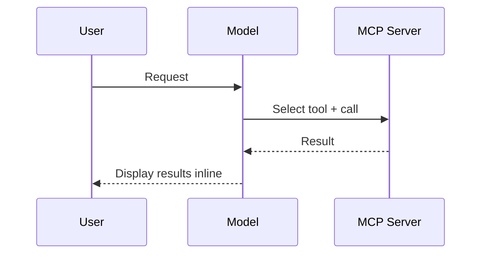
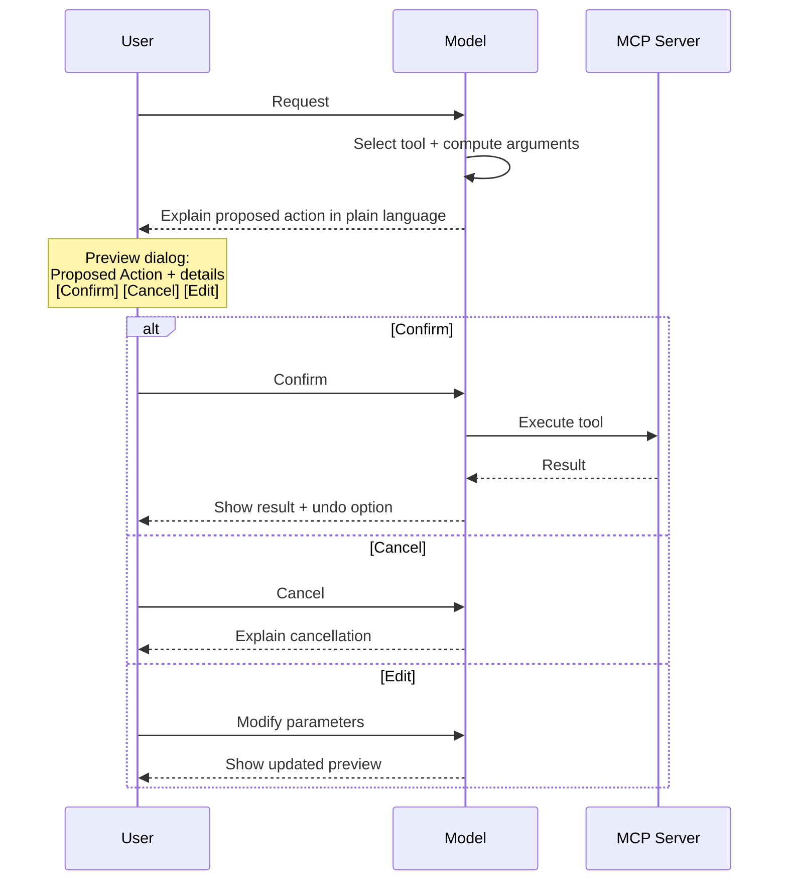
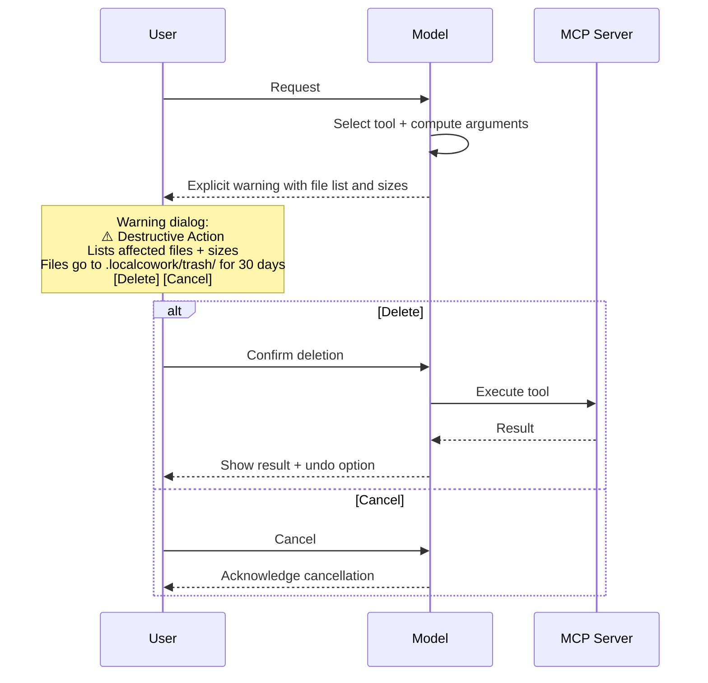
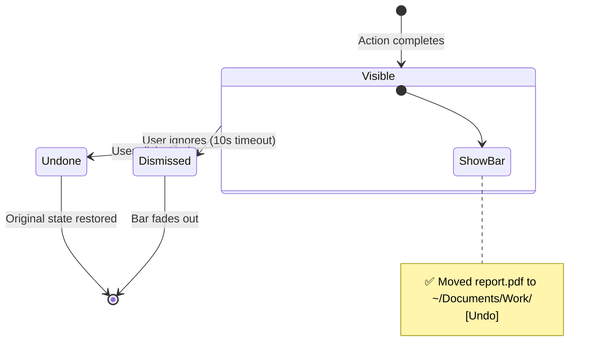

# Human-in-the-Loop Control Flow

> Every tool execution in LocalCowork follows a confirmation + undo pattern.
> This document specifies the exact flow for each action category.

## Core Principle

The user is always in control. The model proposes, the user disposes. Every mutable action shows a preview before executing, and every destructive action can be undone.

## Action Categories

### Non-Destructive Actions (execute immediately)

Tools that only read data — no confirmation needed, results displayed inline.

**Tools in this category:**
- `filesystem.list_dir`, `filesystem.read_file`, `filesystem.search_files`, `filesystem.get_metadata`
- `ocr.extract_text_from_image`, `ocr.extract_text_from_pdf`, `ocr.extract_structured_data`, `ocr.extract_table`
- `document.extract_text`, `document.diff_documents`, `document.read_spreadsheet`
- `security.scan_for_pii`, `security.scan_for_secrets`, `security.find_duplicates`, `security.propose_cleanup`
- `knowledge.search_documents`, `knowledge.ask_about_files`, `knowledge.get_related_chunks`
- `calendar.list_events`, `calendar.find_free_slots`
- `email.list_drafts`, `email.search_emails`, `email.summarize_thread`
- `task.list_tasks`, `task.get_overdue`, `task.daily_briefing`
- `data.query_sqlite`, `data.deduplicate_records`, `data.summarize_anomalies`
- `audit.get_tool_log`, `audit.get_session_summary`, `audit.generate_audit_report`
- `clipboard.get_clipboard`, `clipboard.clipboard_history`
- `system.get_system_info`, `system.take_screenshot`, `system.list_processes`

**Flow:**



### Mutable Actions (preview + confirm)

Tools that create, modify, or move data — show preview, wait for confirmation.

**Tools in this category:**
- `filesystem.write_file`, `filesystem.move_file`, `filesystem.copy_file`, `filesystem.watch_folder`
- `document.convert_format`, `document.create_pdf`, `document.fill_pdf_form`, `document.merge_pdfs`, `document.create_docx`
- `knowledge.index_folder`, `knowledge.update_index`
- `calendar.create_event`, `calendar.create_time_block`
- `email.draft_email`
- `task.create_task`, `task.update_task`
- `data.write_csv`, `data.write_sqlite`
- `audit.export_audit_pdf`
- `clipboard.set_clipboard`
- `system.open_application`, `system.open_file_with`
- `meeting.generate_minutes`
- `security.encrypt_file`, `security.decrypt_file`

**Flow:**



### Destructive Actions (explicit warning + typed confirmation)

Tools that permanently remove data — elevated warning, may require typing confirmation.

**Tools in this category:**
- `filesystem.delete_file`
- `email.send_draft` (sending is irreversible)

**Flow:**



## Undo System

### Undo Stack

Every mutable/destructive action pushes an entry to the undo stack:

```sql
CREATE TABLE undo_stack (
    id INTEGER PRIMARY KEY AUTOINCREMENT,
    session_id TEXT NOT NULL,
    timestamp TEXT NOT NULL DEFAULT CURRENT_TIMESTAMP,
    tool_name TEXT NOT NULL,
    action_type TEXT NOT NULL,  -- 'move', 'delete', 'create', 'write'
    original_state TEXT,        -- JSON: original path, content hash, etc.
    new_state TEXT,             -- JSON: new path, etc.
    undone BOOLEAN DEFAULT FALSE
);
```

### Undo Operations

| Action | Undo Behavior |
|--------|--------------|
| `filesystem.move_file` | Move file back to original path |
| `filesystem.delete_file` | Restore from `.localcowork/trash/` |
| `filesystem.write_file` | Restore previous version (if it existed) |
| `filesystem.copy_file` | Delete the copy |
| `calendar.create_event` | Delete the event |
| `task.create_task` | Delete the task |

### Undo UI

After every mutable action, show a transient undo bar. The bar displays the completed action with an undo button, persists for 10 seconds, then fades. The user can also access the full undo history from the Settings panel.



## Audit Integration

Every action (including confirmation/rejection) is logged to the audit table:

```sql
INSERT INTO audit_log (session_id, timestamp, tool_name, arguments, result, result_status, user_confirmed, execution_time_ms)
VALUES (?, datetime('now'), ?, ?, ?, ?, ?, ?);
```

- `result_status`: 'success', 'error', 'rejected_by_user'
- `user_confirmed`: true if user clicked Confirm, false if auto-executed (non-destructive)

## Multi-Step Workflows

When the model plans a multi-step workflow (e.g., UC-1 Receipt Reconciliation), the flow is:

1. Model presents the **full plan** (all steps listed)
2. User can approve the entire plan or approve step-by-step
3. Non-destructive steps execute without pausing
4. Mutable steps pause for confirmation at each step
5. If any step fails, the workflow pauses and explains the error
6. User can retry, skip, or abort the remaining steps

## Implementation Notes

- The ToolRouter in the Agent Core is responsible for checking `confirmationRequired` before dispatching.
- The frontend Confirmation components render the preview and collect the user's response.
- The undo stack is managed by the Agent Core, not by individual MCP servers.
- Servers only need to declare their metadata — the confirmation logic is centralized.
